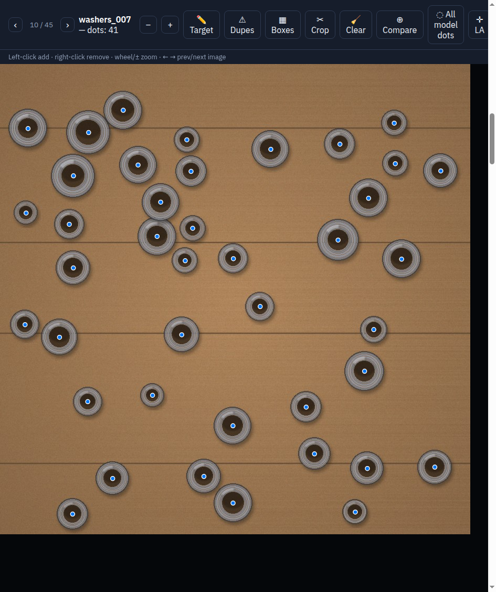
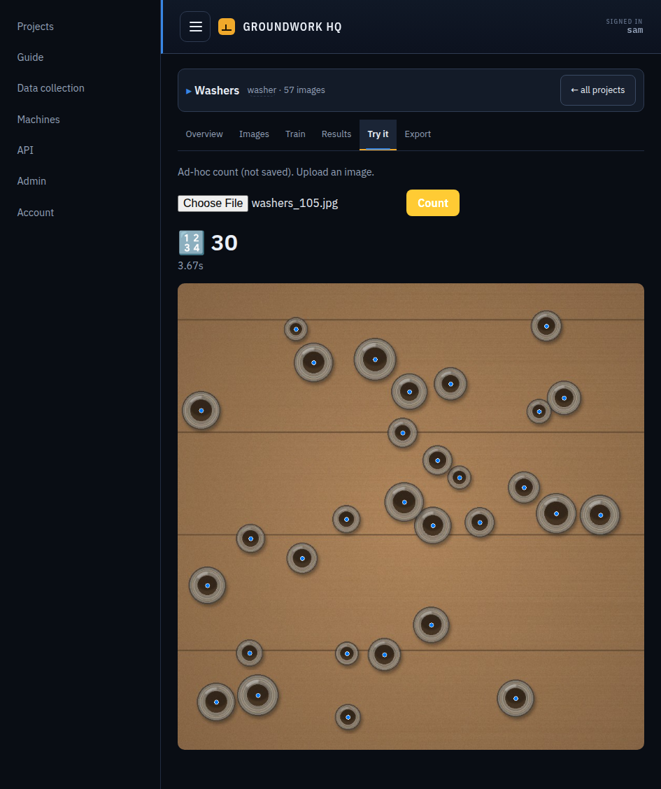
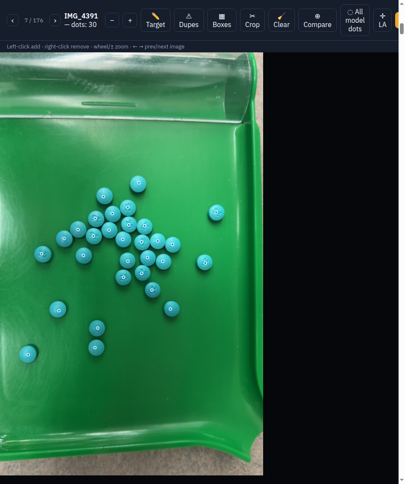

<div align="center">

<h1>Groundwork</h1>

<b>Teach a computer to count anything you can photograph.</b>

<p>
  <a href="LICENSE"></a>
  
  <a href="https://github.com/gammahazard/groundwork/actions/workflows/ci.yml"></a>
  
  
  
</p>

<b><a href="https://groundwork-trainer.vercel.app">groundwork-trainer.vercel.app</a></b> — the tour, in one scroll.

</div>

Groundwork is a self-hosted trainer for object-detection models, built around one loop:
create a project, collect images, label them in the browser, train — on this machine or
on a paired GPU box — and judge every run on a frozen holdout by the metric that matters
for counting: per-image count error, not mAP. The best run gets pinned and served, through
the web cockpit, the API, or a Telegram bot that collects new training data while it counts.

It is one FastAPI service, a plain-JS frontend with no build step, and filesystem state
you can read with `cat`. It runs on a laptop; it scales to a small fleet of GPU workers
over ssh and rsync.

<p align="center">
  
</p>
<p align="center"><i>Label by clicking once per object — the count in the corner is the label.</i></p>
<p align="center">
  
</p>
<p align="center"><i>Then upload any photo and get the count back with an overlay.</i></p>

---

**Contents:** [Features](#features) · [Proven in the field](#proven-in-the-field) ·
[Requirements](#requirements) · [Quickstart](#quickstart) ·
[Documentation](#documentation) · [Philosophy](#philosophy) · [License](#license)

---

## Features

- **Projects.** Each project owns its classes, its image tags, its dataset tree, its bots
  and its owner. There is no default project and no implicit one — a fresh instance starts
  blank, and nothing can silently operate on the wrong dataset.
- **A browser dot editor.** Left-click adds, right-click removes, arrow keys move between
  images; on touch, tap selects and a thumb pad acts. A Boxes mode sizes the extent of any
  detection when a dot is not enough.
- **Frozen-holdout discipline.** The test set is exclusive from the training pool by
  construction — an image *moves* between collections, it is never copied — and once an
  image is in the holdout it is never trained on.
- **An honest exam.** Runs are ranked by count MAE (per image), with the operating point
  (conf/iou) swept and served from each run's own eval. The eval reports what a single
  number hides: how many grid cells *tied* with the winner, and whether the winner sat on
  the grid's edge — so "best" is never quietly a tie-break or a floor.
- **A model registry.** YOLOv8n is the default family; Apache-2.0 challengers ride the
  same exam. D-FINE is built in (main environment); DEIM and RTMDet install as opt-in
  sidecar stacks. One registry entry per family — venv, license, sizes, measured peak
  VRAM — read by everything that dispatches.
- **One Train control** across every machine × card, answered up front: whether a card can
  *run* a family (its torch build's kernels) and whether it can *hold* it (measured peak
  VRAM at the requested size and batch) are both measured, and a refusal always carries
  its reason. Deliberate overrides — running beside another job, spilling past VRAM — are
  opt-in by name, never defaults.
- **Telegram data-collection bots**, one per project: photo in, count back, and the
  ✓/✗ feedback buttons route the image into the fix queue, so training data arrives
  continuously from the field.
- **Multi-machine training** with one-way credentials: HQ holds a worker-scoped key and an
  ssh identity; the worker holds nothing of HQ's. Datasets mirror to workers before every
  remote run, finished runs are adopted home, and workers refuse dataset edits server-side.
- **Accounts and API keys.** Server-side sessions for people, scoped keys
  (`read`/`train`/`full`) for scripts, scrypt passwords, throttled logins, per-project
  ownership, and an append-only audit trail.

---

## Proven in the field

<!-- case-study:begin -->
Groundwork wasn't designed on a whiteboard — it grew around a real deployment:
a **pill-counting system** used by pharmacy technicians. That model was trained,
evaluated and served entirely through this pipeline: photos arrive by Telegram
bot, every count is verified by a person, corrections flow back into training,
and the same trained detector runs on-device in an iOS app via the CoreML
export and on a live bench camera. Across recent runs it counts exactly on
95–100% of a frozen 69-photo holdout.

<p align="center">
  
</p>
<p align="center"><i>The original deployment in the editor — 30 tablets, 30 dots.</i></p>

*Not a medical device: every count is checked by a person; the tooling exists
to make that verification effortless.*
<!-- case-study:end -->

---

## Requirements

Linux, or Windows via WSL2 / Docker Desktop. Docker is the recommended path;
native installs need Python 3.10+. An NVIDIA GPU is only needed to *train* —
projects, labeling and review all work without one, and GPU machines can be
paired later.

---

## Quickstart

### Docker (recommended)

```sh
git clone https://github.com/gammahazard/groundwork.git
cd groundwork/docker
docker compose up
```

Open `http://localhost:8000`. On a fresh instance the first-run wizard walks you through
creating the admin account, naming the machine, probing the GPU, and creating your first
project. GPU selection, the CPU-only variant and the data volume are covered in
[docker/README.md](docker/README.md).

**On Windows** — prerequisite either way: [Docker Desktop](https://www.docker.com/products/docker-desktop/)
installed and *running*. Then pick your terminal:

- **WSL terminal** (recommended): the same three commands as above, unchanged —
  full speed, and the data stays a browsable folder. Needs a WSL distro with
  Desktop's WSL integration switched on (Settings → Resources → WSL
  integration); no distro yet means `wsl --install` first.
- **PowerShell terminal**: same commands, but add the fast-storage overlay to
  the last one ([why, and the trade](docker/README.md#windows)) — and git is
  optional, PowerShell can fetch the source itself:

  ```powershell
  Invoke-WebRequest https://github.com/gammahazard/groundwork/archive/refs/heads/main.zip -OutFile groundwork.zip
  Expand-Archive groundwork.zip .
  cd groundwork-main\docker
  docker compose -f docker-compose.yml -f docker-compose.windows.yml up
  ```

### Native (systemd)

```sh
git clone https://github.com/gammahazard/groundwork.git
cd groundwork
./scripts/install.sh          # venv + the right torch build for your GPU
.venv/bin/groundwork install  # systemd user units + timers
```

Or, with no systemd at all, `groundwork run` starts everything in the foreground. The full
walkthrough — prerequisites, headless bootstrap, upgrades, WSL2 notes — is in
[docs/install.md](docs/install.md).

---

## Documentation

- [docs/install.md](docs/install.md) — native install, first run, upgrades
- [docs/architecture.md](docs/architecture.md) — how the pieces fit, and where every file lives
- [docs/training.md](docs/training.md) — the data → train → eval → serve loop
- [docs/machines.md](docs/machines.md) — pairing GPU workers, what syncs when
- [docs/bots.md](docs/bots.md) — Telegram bots
- [docs/models.md](docs/models.md) — the model registry and the challenger stacks
- [docs/api.md](docs/api.md) — auth, conventions, examples, and a generated catalog of every route
- Interactive API reference: `/docs` on your own instance, once signed in

---

## Philosophy

- **Measured over assumed.** Which card can train which model is probed, not configured.
  Peak VRAM comes from training logs, not spec sheets. Whether a worker is up to date is an
  endpoint, not a guess.
- **Refusals carry reasons.** When the Train button is disabled, the UI shows why, in
  words. When a worker refuses an edit, the error says where editing lives. A refusal
  without a reason is indistinguishable from a bug.
- **Silent wrong-data is the expensive failure.** Every stage that touches a dataset is
  told its project explicitly and prints project, root and image count before doing work.
  A typo'd project is a 404, never a fall-back to somebody else's data.
- **The holdout is frozen.** No image in it is ever trained on, and no synthetic data is
  derived from it. Every score in the ledger means the same thing, forever.
- **Look at the pictures.** The eval writes a preview for every holdout image. The most
  consequential model bugs this platform has caught were found by looking at previews, not
  by reading aggregate numbers.

---

## License

Groundwork is licensed under [AGPL-3.0](LICENSE).

Model licensing is surfaced per family in the cockpit, because it varies:

- **YOLOv8n** trains through [ultralytics](https://github.com/ultralytics/ultralytics)
  (AGPL-3.0, same as this repo). Upstream's stated position is that the AGPL extends to
  trained weights — factor that into any plan to distribute a model.
- **D-FINE, DEIMv2, RTMDet, RF-DETR** are Apache-2.0 — the reason the challenger track
  exists at all.
- **LocateAnything-3B**, the optional auto-labeler, is under NVIDIA's license. It is never
  shipped with Groundwork; the setup wizard offers it as a download from Hugging Face
  after showing the license, and you can decline it and label by hand.

See [THIRD_PARTY_NOTICES.md](THIRD_PARTY_NOTICES.md) for the complete list.
